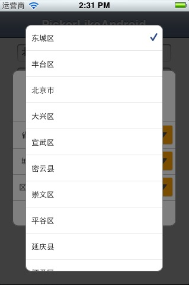

PickerLikeAndroid
===========

仿照Android Picker样式定制UIView，为了增加通用性此UIView只展现界面，业务逻辑、数据都通过delegate方式放在调用页面中。
   
  

  
思路
---
封装变化，每组变量是 :  
此组所对应的实体 entity;  
此组显示所对应的实体属性showProperty；  
下一组需要传递的实体属性passProperty；  
选中项所对应的索引 row ；  
此组所对应的数据的集合（动态,受上一组变化而变化）array。    

按照MVC框架原理，这个自定义类UIView（V）只展现界面，业务逻辑、数据都放在调用页面中（Controller）。
用3个委托方法来实现,大体可以这样理解:  
entity、showProperty --> textOfRow:inComponent:rowArray: 需要显示此组内容时通过delegate将数据在页面传过来  
passProperty、array --> arrayOfRowArray:inComponent: 索引发生变化时通过delegate将数据在页面传过来  
row -- > selectDataOfRowArray: 选择完成时将索引集合传到页面中

缺点
---
在页面取数据时冗余会很大，会重复调用多次。webservice方式取数据或numberOfComponents大于3 就不建议使用了，效率低。

What you need
---
* [PickerLikeAndroidView.h](https://github.com/Ericfengshi/PickerLikeAndroid/blob/master/PickerLikeAndroidView.h)
* [PickerLikeAndroidView.m](https://github.com/Ericfengshi/PickerLikeAndroid/blob/master/PickerLikeAndroidView.m)
* [PickerDataTableView.h](https://github.com/Ericfengshi/PickerLikeAndroid/blob/master/PickerDataTableView.h)
* [PickerDataTableView.m](https://github.com/Ericfengshi/PickerLikeAndroid/blob/master/PickerDataTableView.m)
* PickerLikeAndroid.bundle

How to use
---  
详细请见[ViewController.h](https://github.com/Ericfengshi/PickerLikeAndroid/blob/master/PickerLikeAndroid/ViewController.m)

PickerLikeAndroidDelegate
---  

```objective-c
/**
 * 选择器选择完成
 * @param rowArray :
    选择器视图 每组选中的索引集合
 * @return
 */
-(void)selectDataOfRowArray:(NSMutableArray *)rowArray;
/**
 * 本组此索引对应的内容
 * @param row :
    选择器视图 此组下的内容索引
 * @param component :
    选择器视图 哪一组
 * @param rowArray :
    选择器视图 每组索引的集合
 * @return NSString
 */
-(NSString *)textOfRow:(NSInteger)row inComponent:(NSInteger)component rowArray:(NSMutableArray *)rowArray;
/**
 * 本组此索引下的数据集合
 * @param rowArray :
    选择器视图 每组索引的集合
 * @param component :
    选择器视图 哪一组
 * @return NSMutableArray
 */
-(NSMutableArray*)arrayOfRowArray:(NSMutableArray *)rowArray inComponent:(NSInteger)component;

```
